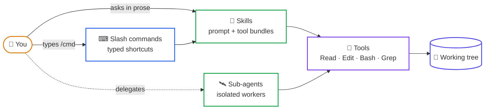
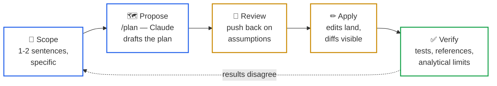
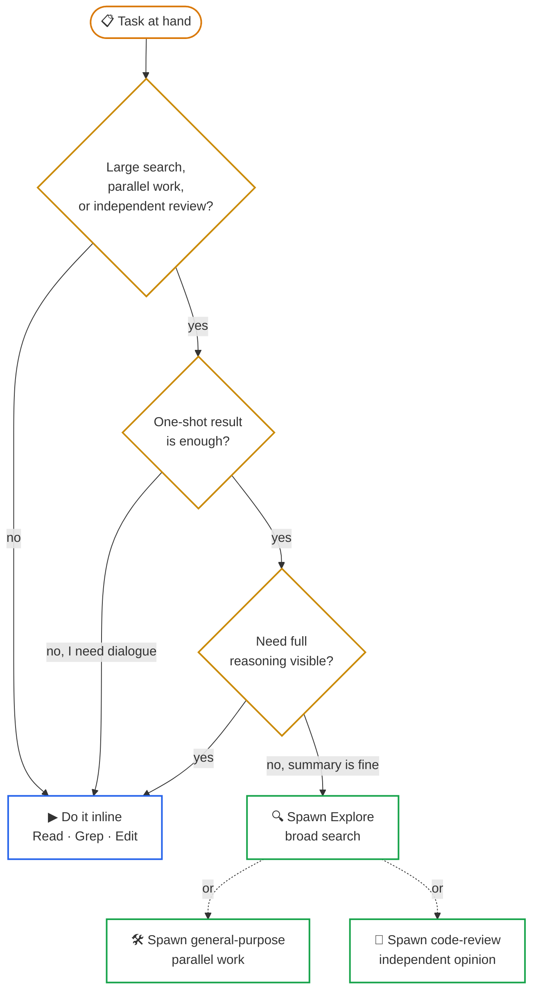
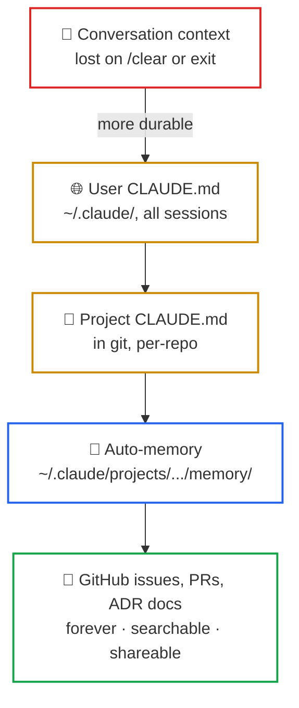
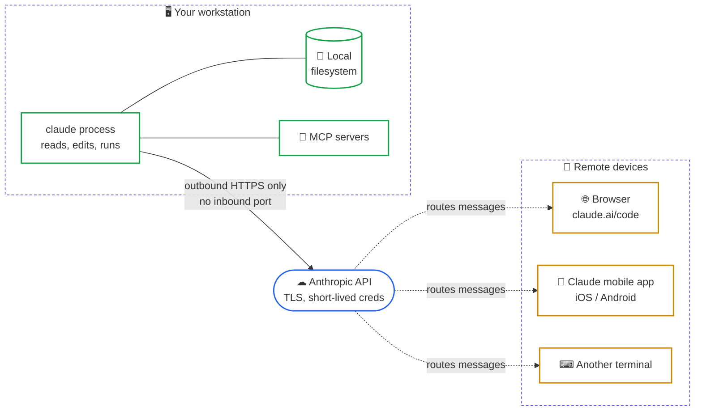

# Claude Code at CNR-IAC — Researcher Onboarding

**Audience.** CNR-IAC researchers in mathematics, physics, and HPC who
already write code (in any programming language) and now have access to the
institute's Claude Code team plan. You do not need prior experience with LLM
tools; you do need to know your own domain.

**Scope.** This document teaches Claude Code mechanics. It assumes you can
read a stack trace, run a compiler, and debug an HPC job — the examples
illustrate Claude Code features using tasks of that flavour, not as tutorials
in the underlying science.

**Status.** Living document maintained by Stefano Zaghi (beta-tester for the
team account, `stefano.zaghi@cnr.it`). Corrections, additions, and surprising
experiences worth recording are welcome — see
[§16 Getting help](#16-getting-help) for how to open a GitHub issue (with a
step-by-step for colleagues new to GitHub).

---

## Table of contents

 1. [What Claude Code is (and isn't)](#1-what-claude-code-is-and-isnt)
 2. [Account and first run](#2-account-and-first-run)
 3. [Where configuration lives](#3-where-configuration-lives)
 4. [Mental model — four nouns](#4-mental-model--four-nouns)
 5. [Anatomy of a working session](#5-anatomy-of-a-working-session)
 6. [Choosing a model](#6-choosing-a-model)
 7. [Slash commands and skills](#7-slash-commands-and-skills)
 8. [Sub-agents](#8-sub-agents)
 9. [Memory and persistence](#9-memory-and-persistence)
10. [Remote control — driving Claude from another device](#10-remote-control--driving-claude-from-another-device)
11. [Useful skills, plugins, and commands](#11-useful-skills-plugins-and-commands)
12. [Cost discipline](#12-cost-discipline)
13. [HPC-specific prompt patterns](#13-hpc-specific-prompt-patterns)
14. [Safety rails](#14-safety-rails)
15. [CNR-IAC data governance](#15-cnr-iac-data-governance) — **TODO, fill from institute policy**
16. [Getting help](#16-getting-help)
17. [Appendix — glossary](#17-appendix--glossary)

---

## 1. What Claude Code is (and isn't)

Claude Code is a terminal-native coding agent. You launch it inside a project
directory; it can read your files, edit them, run shell commands, invoke
compilers, drive a test suite, and write commits. It is not a chat window
that returns text for you to paste — it operates on your working tree
directly, under your supervision.

| Claude Code **is**                                          | Claude Code **is not**                                                            |
| ----------------------------------------------------------- | --------------------------------------------------------------------------------- |
| A terminal-native agent that reads and edits your files     | A chat window that returns text for you to paste                                  |
| A pair-programmer that follows your prompts literally       | A replacement for understanding your own code                                     |
| A driver for shell commands, compilers, tests, and git      | An HPC scheduler — it does not know about Slurm queues unless you tell it         |
| A cloud service — every prompt and read file goes to Anthropic | Offline-capable — see [§15 Data governance](#15-cnr-iac-data-governance)        |
| Domain-agnostic — it has read a lot of code                 | Familiar with *your* code on first launch — context starts empty                  |

> **Mental model.** A sharp, fast pair-programmer who has read a lot of code
> but has never seen *your* code before this session, and who will do exactly
> what you ask — including the wrong thing if your prompt is ambiguous.

**Official documentation.** The canonical reference is
[`https://code.claude.com/docs/`](https://code.claude.com/docs/). This file
summarises what a CNR-IAC researcher needs to start being productive; the
official docs are authoritative for everything else.

---

## 2. Account and first run

### 2.1 Installing the CLI

The CLI is distributed as a single native binary; it does **not** require
Node.js, npm, or any other runtime. Anthropic provides one-line installers
for every supported platform.

> Authoritative reference:
> [`https://code.claude.com/docs/en/setup`](https://code.claude.com/docs/en/setup)
> — read it once. The summary below is convenience, not a substitute.

**Linux / macOS / WSL — recommended:**

```bash
curl -fsSL https://claude.ai/install.sh | bash
```

This downloads the platform-appropriate binary into `~/.local/bin/claude`
and auto-updates it in the background.

If you prefer your system package manager (no auto-update, you upgrade
manually):

| Platform                  | Command                                                 |
| ------------------------- | ------------------------------------------------------- |
| macOS (Homebrew)          | `brew install --cask claude-code`                       |
| Debian/Ubuntu (apt)       | see the apt-repo setup in the official docs             |
| Fedora/RHEL (dnf)         | see the dnf-repo setup in the official docs            |
| Alpine (apk)              | see the apk-repo setup in the official docs            |
| Windows (WinGet)          | `winget install Anthropic.ClaudeCode`                   |
| Any platform (npm global) | `npm install -g @anthropic-ai/claude-code` (Node ≥ 18)  |

**Windows.** Two equally supported paths. Pick based on where your projects
live:

- **WSL 2 (recommended for HPC/Linux toolchains).** Open your WSL Ubuntu
  shell and run the Linux installer above. Launch `claude` from inside WSL,
  not from PowerShell.
- **Native Windows.** PowerShell:
  `irm https://claude.ai/install.ps1 | iex`. Installing
  [Git for Windows](https://git-scm.com/downloads/win) is optional but
  recommended — it gives Claude Code access to Git Bash for shell
  operations.

**System requirements** (excerpt from the official setup page): macOS 13+,
Windows 10 1809+, Ubuntu 20.04+, Debian 10+, Alpine 3.19+; 4 GB+ RAM;
internet connection. See the official page for the full matrix.

### 2.2 First login

```bash
claude
```

On first invocation you are prompted to authenticate. Use your CNR-IAC
team-account credentials (sign in through the browser when prompted). The
token is stored under `~/.claude/`. Do not commit
`~/.claude/.credentials.json` to any repo — it is your authentication
secret.

> If you already have an `ANTHROPIC_API_KEY` set in your shell environment,
> unset it before logging in to the team plan. API-key auth and
> team-plan/OAuth auth are different worlds and will conflict.

### 2.3 Verifying the install

```bash
claude --version       # prints the CLI version
claude doctor          # detailed health check of install and config
```

Then inside an interactive Claude Code session:

```
/cost     # show usage and remaining quota for the current session
/model    # show or change the model
/help     # built-in help and command list
```

If `/cost` reports an unexpected billing account, you are not on the team
plan — stop and contact the beta-tester before continuing.

### 2.4 Pointers for further reading

- Quickstart (your first session, end-to-end):
  [`https://code.claude.com/docs/en/quickstart`](https://code.claude.com/docs/en/quickstart)
- Terminal primer (if the shell itself is new):
  [`https://code.claude.com/docs/en/terminal-guide`](https://code.claude.com/docs/en/terminal-guide)
- Troubleshooting install/login:
  [`https://code.claude.com/docs/en/troubleshoot-install`](https://code.claude.com/docs/en/troubleshoot-install)

---

## 3. Where configuration lives

Claude Code reads configuration from a small set of well-defined paths. Know
where they are; you will edit them often.

### 3.1 The four files (and one directory) that matter

| Path                                  | Scope       | Checked into repo? | Purpose                                                  |
| ------------------------------------- | ----------- | ------------------ | -------------------------------------------------------- |
| `~/.claude/CLAUDE.md`                 | User-global | No                 | Your persona, coding preferences, things you never want done |
| `~/.claude/settings.json`             | User-global | No                 | Permissions, env vars, hooks, default model              |
| `~/.claude/settings.local.json`       | Machine     | No (gitignored)    | Per-machine overrides — never committed                  |
| `~/.claude/commands/`                 | User-global | No                 | Your personal slash commands (one `.md` per command)     |
| `<project>/CLAUDE.md`                 | Project     | **Yes**            | Per-project conventions, build commands, gotchas         |
| `<project>/.claude/settings.json`     | Project     | **Yes**            | Per-project permissions and hooks shared with the team   |

**Precedence.** Project settings override user settings; machine-local
settings override both. The matching `CLAUDE.md` files are *additive* — both
the user and the project file are loaded into every session, with the
project file last (so it wins in case of conflict).

```mermaid
flowchart TD
    accTitle: Claude Code Configuration Precedence
    accDescr: How Claude Code merges configuration from user-global, project, and machine-local sources. Settings files cascade with later layers overriding earlier ones; CLAUDE.md files are additive with the project file winning on conflict.

    subgraph settings_layer["settings.json — last write wins"]
        user_settings["~/.claude/settings.json<br/>user-global"]
        project_settings["&lt;project&gt;/.claude/settings.json<br/>project, in git"]
        local_settings["~/.claude/settings.local.json<br/>machine, gitignored"]
    end

    subgraph instructions_layer["CLAUDE.md — additive, both loaded"]
        user_md["~/.claude/CLAUDE.md<br/>user-global"]
        project_md["&lt;project&gt;/CLAUDE.md<br/>project, in git"]
    end

    user_settings -->|"overridden by"| project_settings
    project_settings -->|"overridden by"| local_settings
    user_md -->|"appended by"| project_md

    classDef user fill:transparent,stroke:#2563eb,stroke-width:2px
    classDef project fill:transparent,stroke:#16a34a,stroke-width:2px
    classDef machine fill:transparent,stroke:#ca8a04,stroke-width:2px

    class user_settings,user_md user
    class project_settings,project_md project
    class local_settings machine

    style settings_layer fill:transparent,stroke:#4f46e5,stroke-width:1px,stroke-dasharray:4 3
    style instructions_layer fill:transparent,stroke:#4f46e5,stroke-width:1px,stroke-dasharray:4 3
```



### 3.2 `~/.claude/CLAUDE.md` — your global instructions

This is where you teach Claude *who you are* and *how you work*. It is
loaded into every session on every project.

Skeleton (you fill it in for your role and preferences):

```markdown
# <your name> — Claude global preferences

## Interaction style
- <How blunt do you want feedback to be? What hedging do you want avoided?>
- <Do you prefer push-back or accommodation when you propose something wrong?>

## Repository layout
- <Where do your projects live on disk? e.g. ~/code/, ~/work/, ~/projects/>
- <Naming patterns Claude should know — what "the X repo" refers to>

## Languages and toolchains
- <Primary languages, compilers, build systems you use>
- <Linters / formatters that are already in your pre-commit hooks
  (so Claude can stop wasting effort on style nits)>

## Documentation conventions
- <Docstring style — NumPy / Google / JSDoc / Doxygen / FORD>
- <Comment density — minimal? thorough? what triggers a comment?>

## Commit conventions
- <Conventional Commits? Other? Sign-offs? Co-author lines?>

## Anything Claude should NEVER do
- <e.g. never amend a commit, never force-push, never run sudo,
  never paste credentials anywhere>
```

Keep it focused and durable. Things that change every week belong in the
session, not here.

### 3.3 `~/.claude/settings.json` — global settings

This is JSON, not markdown. It controls *behaviour*, not *style*.
Skeleton:

```json
{
  "permissions": {
    "allow": [
      "Bash(git status:*)",
      "Bash(git diff:*)",
      "Bash(ls:*)"
    ],
    "ask": [],
    "deny": []
  },
  "env": {
  },
  "hooks": {
  },
  "model": "claude-sonnet-4-6"
}
```

Notable keys:

- **`permissions.allow`** — Bash commands and tool patterns auto-approved
  without asking. Use this to cut down on permission prompts for read-only
  commands you trust (`git status`, `ls`, `cat`, etc.). Do **not** add write
  or destructive commands here.
- **`permissions.deny`** — explicit denylist. Useful if you want to lock out
  whole categories of action.
- **`env`** — environment variables passed into the Claude process. Useful
  for `DISABLE_TELEMETRY=1`, `CLAUDE_CODE_GIT_BASH_PATH=...`, etc.
- **`hooks`** — shell commands that run on harness events (after every tool
  call, on prompt submission, on session stop). See
  [`https://code.claude.com/docs/en/hooks`](https://code.claude.com/docs/en/hooks).
- **`model`** — default model for new sessions. Override per-session with
  `/model`.

Full schema:
[`https://code.claude.com/docs/en/settings`](https://code.claude.com/docs/en/settings).

### 3.4 `~/.claude/settings.local.json` — machine-specific overrides

Same shape as `settings.json` but ignored by Stow/git. This is where you put
things that only apply on *this* machine — a path to a local compiler, a
GPU id, a workstation-only allow-list. Keep it out of dotfiles repos.

### 3.5 `~/.claude/commands/` — your custom slash commands

Each file is one command. Filename = command name. The file body is the
prompt that Claude expands when you type `/<name>`.

Skeleton (`~/.claude/commands/<name>.md`):

```markdown
---
description: One-line summary shown when /help lists commands
---

<the prompt that Claude will execute when you type /<name>>

You can reference $ARGUMENTS to capture whatever the user types after
the command name. You can also tell Claude exactly which tools to use,
what scope to consider, and what *not* to do.
```

Drop the file in `~/.claude/commands/` and `/<name>` is immediately
available in the next session. Examples already in use are listed in
[§11 Useful skills, plugins, and commands](#11-useful-skills-plugins-and-commands).

### 3.6 Per-project `CLAUDE.md`

When you launch Claude inside a project, it loads the project's
`CLAUDE.md` (if any) on top of your global one. This is where to put:

- The build command(s) and how to run the test suite.
- Project-specific conventions (style, layout, naming).
- "Gotchas" — places where the obvious thing is wrong.
- Pointers to the documentation that lives in the repo.

Run `/init` once in a fresh repo to scaffold a starter `CLAUDE.md`; edit
from there. Keep it under ~200 lines — Claude loads it on every turn, so
length costs tokens.

### 3.7 Per-project `.claude/settings.json`

Same shape as the user-global settings file. Use it for permissions and
hooks that should be shared with every collaborator on the project (it is
checked into the repo). A common pattern:

```json
{
  "permissions": {
    "allow": [
      "Bash(make test:*)",
      "Bash(make lint:*)"
    ]
  }
}
```

so every contributor's Claude can run the project's standard build/test
recipes without per-user prompts.

---

## 4. Mental model — four nouns

Claude Code's surface has four kinds of building blocks. Knowing the
distinction is the single largest predictor of effective use.

**Tools.** Atomic capabilities the model can invoke: `Read`, `Edit`, `Write`,
`Bash`, `Grep`, `Glob`. These are the verbs. You almost never invoke them
directly; you ask in natural language and the model picks the tool.

**Slash commands.** Shortcuts you type, prefixed with `/` (e.g. `/help`,
`/cost`, `/model`, `/review`). Some are built in, some you can write
yourself (`~/.claude/commands/<name>.md`). They expand into prompts or
trigger skills.

**Skills.** Larger, structured capabilities the model loads on demand —
think of them as specialised prompt-and-tool bundles. Examples:
`code-review`, `verify`, `init`. Skills declare their trigger conditions
and the model invokes them automatically when relevant, or you can call one
explicitly via `/skillname` or by asking by name.

**Sub-agents.** A spawn of a fresh model instance with its own context
window. You use sub-agents to (a) parallelise independent work, (b) keep
noisy results out of your main conversation, or (c) get a second opinion
from an isolated reviewer. See [§8 Sub-agents](#8-sub-agents).

In one sentence: **tools** are how the model acts, **slash commands** are
how you trigger structured prompts, **skills** are reusable capability
bundles, **sub-agents** are isolated workers.



---

## 5. Anatomy of a working session

A productive session has roughly this shape.

**1. Open Claude in the relevant project.** Always launch from the project
root, never from `$HOME`. The project's `CLAUDE.md` (if present) is loaded
automatically and gives Claude the local conventions.

```bash
cd ~/code/my-solver
claude
```

**2. Define the task in one or two sentences.** Be specific about scope.
Not: "clean up the solver." Instead: "in `src/solver.f90`, the routine
`compute_residual` allocates work arrays on every call — refactor it so the
arrays are module-level persistent buffers, and add a `finalize` routine
that deallocates them."

**3. Use plan mode for non-trivial work.** Type `/plan` (or trigger it with
the `Plan` agent). Claude proposes a step-by-step plan before touching any
file. Read it. Push back on assumptions. Approve only when the plan matches
your intent. This catches misunderstandings before they cost edits.

**4. Watch the diff.** When Claude edits a file, you see the diff. Do not
batch-approve a long stream of edits without reading them. A misnamed
intermediate variable is cheap; a silently swapped sign in a numerical
kernel is not.

**5. Verify behaviour, not just compilation.** "It compiles" is not "it
works." Ask Claude to run the test suite, or run it yourself. For numerical
code, compare against a known reference — a regression test, a previous
output, or an analytical limit.

**6. Commit yourself.** By default Claude will not run `git commit` unless
you ask. Keep it that way — review the diff, write the commit message,
commit in your terminal.

**Worked example — interface review of a module.**

```
You: In src/halo.f90, the subroutine exchange_halo has 11 dummy
     arguments and no intent declarations. Review its interface, propose a
     derived-type refactor that groups the MPI communicator, the topology
     descriptors, and the halo-width parameters. Do not edit yet — show
     the proposed type and the new signature first.

Claude: [reads the file, proposes a TYPE :: halo_ctx_t with components ...,
         shows the new SUBROUTINE exchange_halo(ctx, field, ierr) signature,
         lists the call sites that would need updating]

You: Approved. Apply the refactor; update all call sites; run the build.
```

The pattern is: scope → propose → review → apply → verify. Skipping
"propose" and going straight to "apply" is where most bad outcomes happen.



---

## 6. Choosing a model

Three families are available on the team plan:

| Model       | Strengths                                         | When to use                                              |
| ----------- | ------------------------------------------------- | -------------------------------------------------------- |
| Opus 4.7    | Deepest reasoning, longest planning chains        | Hard refactors, MPI/GPU debugging, design discussions    |
| Sonnet 4.6  | Strong general-purpose, faster, lower cost        | Default for most code tasks                              |
| Haiku 4.5   | Fastest, cheapest, smaller context per token      | Mechanical edits, renames, repetitive sweeps             |

Switch with `/model opus`, `/model sonnet`, or `/model haiku`.

**Rules of thumb for HPC work:**

- **Numerical-kernel review or design**: Opus. The cost of a subtle
  sign-or-precision error swamps any token saving.
- **"Rename `iter` to `iteration` across the repo"**: Haiku. The task is
  mechanical and the LLM cost dominates wall-clock only at scale.
- **Most coding sessions**: Sonnet. Switch up to Opus when you hit a wall.

Cost is real but not the only axis. A botched Opus session is cheaper than
a botched Haiku session that you have to redo on Opus anyway.

> **Rule.** Match the model to the *difficulty* of the task, not to a budget
> instinct. The cheapest model that produces a wrong result is more
> expensive than the right model that produces a correct one.

---

## 7. Slash commands and skills

### 7.1 Built-in slash commands worth knowing

| Command          | What it does                                                 |
| ---------------- | ------------------------------------------------------------ |
| `/help`          | Built-in help and command list                               |
| `/cost`          | Session usage and quota                                      |
| `/model`         | Show or switch model                                         |
| `/clear`         | Clear conversation context (starts fresh)                    |
| `/compact`       | Summarise prior context to free up tokens                    |
| `/review`        | Review the current diff for correctness bugs                 |
| `/init`          | Generate a `CLAUDE.md` for the current project               |
| `/verify`        | Run the app and check that a change actually works           |
| `/plan`          | Enter plan mode — propose before editing                     |
| `/remote-control`| Continue this session from another device                    |

A curated list with links lives in
[§11 Useful skills, plugins, and commands](#11-useful-skills-plugins-and-commands).

### 7.2 Writing your own slash command

Drop a markdown file in `~/.claude/commands/`. The filename is the command
name. The file body is the prompt that gets expanded.

```markdown
---
description: Review the current diff for kind discipline and intent declarations
---

Review the current diff against the project's style guide in CLAUDE.md.
Focus on: precision/kind discipline, intent declarations on dummy
arguments, module-level allocations inside hot loops. Ignore formatting
issues that the project's formatter already handles.
```

Save as `~/.claude/commands/style-review.md`; `/style-review` runs that
prompt.

### 7.3 Skills

Skills are richer than slash commands — they bundle prompts, tool
restrictions, and triggering rules. You typically do not write skills until
you have a recurring workflow that benefits from one. The built-in
`code-review`, `verify`, and `semantic-commit` skills are the ones most
worth learning early.

To see which skills are available in a session, ask Claude
*"what skills are available?"* or check `~/.claude/skills/`.

Authoritative reference:
[`https://code.claude.com/docs/en/skills`](https://code.claude.com/docs/en/skills).

---

## 8. Sub-agents

A sub-agent is a fresh Claude instance spawned by the main session. It has
its own context window, runs in parallel (optionally), and returns a single
summary message when done.

**When to use a sub-agent:**

- **Exploration / search.** "Find every call site of `compute_pressure` and
  classify how each one handles the boundary condition." Spawn an `Explore`
  agent; you get back a structured list, not a flood of grep output in your
  main context.
- **Parallel independent work.** Two refactors in unrelated modules —
  spawn two `general-purpose` agents simultaneously.
- **Second opinion.** A `code-review` agent reviews your diff without
  seeing the conversation that produced it, so its judgement is independent.

**When *not* to use a sub-agent:**

- You only need to read one or two files — use `Read` directly.
- The task requires back-and-forth with you — sub-agents are one-shot.
- You want the sub-agent's reasoning to be visible — only its final
  summary is returned, intermediate steps are lost.



**Worked example.**

> *"Spawn an Explore agent to find every `STOP` and `ERROR STOP` in
> `src/`. For each, report the file, line, surrounding context (3 lines),
> and whether it is inside an `IF (.NOT. mpi_initialised)` guard. Report in
> under 200 words."*

The main session continues uncluttered; the agent's report comes back
condensed.

---

## 9. Memory and persistence

Persistence happens at five layers, from most ephemeral to most durable.



*Layers ordered from most ephemeral (top) to most durable (bottom).*

### 9.1 Conversation context

Everything in the current session. Lost when you exit or `/clear`. Use
`/compact` to summarise it without losing the thread.

### 9.2 Project memory — `<project>/CLAUDE.md`

Checked into the repo. The right place for build commands, conventions,
"gotchas" specific to this codebase. Run `/init` once to generate a starter
file, then edit. See [§3.6](#36-per-project-claudemd).

### 9.3 User memory — `~/.claude/CLAUDE.md`

Your global preferences. Survives across all projects and sessions.
See [§3.2](#32-claudemd--your-global-instructions).

### 9.4 Auto-memory

Claude Code maintains a file-based memory store under
`~/.claude/projects/<project>/memory/` recording facts it learns about you
(role, preferences, ongoing work) so future sessions start with context.
You can inspect or edit these files like any other markdown — see
`MEMORY.md` in that directory for the index.

### 9.5 GitHub as the durable memory store

This is the most underused pattern for the team account, and the highest
leverage for the institute.

**The principle.** A conversation in Claude's context window is expensive
on every turn (tokens are re-sent each time). A GitHub issue or markdown
file in the repo is free to re-read and exists forever. So: **push durable
state out of the session and into the repo.**

Concrete habits:

- **Use a GitHub issue per non-trivial task.** Open an issue stating the
  goal, the constraints, the acceptance criteria. Tell Claude "the
  authoritative description of this task is issue #42 — read it before
  proposing a plan." Now the *task* lives in git, not in a fragile
  conversation. When you reopen the session a week later, point Claude at
  the issue again.

- **Curate the plan in detail before coding.** For a complex task, the
  plan itself should live in the issue (or a `docs/plans/` markdown file
  committed to the repo). A good plan decomposes the work into small,
  independently verifiable steps. The token cost of producing it once is
  amortised across many cheap re-reads.

- **Step-by-step decomposition beats one big prompt.** Break a complex
  task into a numbered checklist (issue body, PR description, or a
  markdown file). Claude tackles one step, you review, commit, move on.
  Each step is a short session with a small context — *much* cheaper than
  one giant session that drifts.

- **Write the outcome back to the issue.** When a step is done, append a
  short note to the issue: what was done, what was learned, what to do
  next. The issue becomes the project memory anyone (including future
  Claude sessions) can reload.

- **Use ADR-style markdown for decisions.** Architectural choices, "we
  considered X and rejected it because Y", non-obvious invariants — these
  belong in `docs/adr/` or `docs/decisions/`, not buried in chat history.

**Rule of thumb.** If you find yourself explaining the same constraint to
Claude in three different sessions, that constraint belongs in the repo —
either in `CLAUDE.md`, in an issue, or in a doc file. The session is for
*doing*, not for *remembering*.

**Why this saves tokens.** Re-reading a curated 50-line issue is cheap.
Re-deriving the same context by chatting your way back to it across 5000
tokens of conversation history is expensive. Move the source of truth
once; pay the small read cost forever.

> **The core rule.** *Session = doing. Repo = remembering.* If a fact will
> still be true next week, it belongs in the repo (issue, PR, ADR, or
> `CLAUDE.md`), not in chat history.

---

## 10. Remote control — driving Claude from another device

> Official documentation:
> [`https://code.claude.com/docs/en/remote-control`](https://code.claude.com/docs/en/remote-control).
> Remote Control is in research preview at the time of writing — features
> and limits may change. **On Team and Enterprise plans, it is off by
> default until the org admin enables the Remote Control toggle in
> [Claude Code admin settings](https://claude.ai/admin-settings/claude-code).**
> If `/remote-control` returns "disabled by your organization's policy",
> contact the beta-tester.

### 10.1 What it is

Remote Control lets you start a Claude Code session on your workstation and
then continue interacting with it from your phone, tablet, or any browser.
**The session keeps running locally** — your filesystem, MCP servers, project
configuration, and tools stay on your machine; the remote device is just a
window into that local session.

The conversation stays in sync across all connected devices. You can type
on your terminal, your phone, and a browser interchangeably during the same
session.

Requires Claude Code v2.1.51 or later. Check with `claude --version`.



### 10.2 Why a researcher would care

Concrete situations where this is worth the setup:

- **Long-running compile / numerical run.** You kick off a multi-hour build
  or a test suite that compiles a large Fortran code, then leave your
  desk. Remote Control lets you check on it from your phone, send Claude a
  follow-up ("the build failed at file X — here is the error, propose a
  fix"), and steer without walking back to the workstation.
- **Babysitting a long agent task.** You ask Claude to do a multi-step
  refactor expected to take 20 minutes of agent work. Walk away; check in
  from your phone; approve the next step from the couch.
- **Push notifications when something finishes.** Claude can send a mobile
  push when a long task completes or when it needs a decision. Useful for
  unattended runs that *might* hit a question.
- **Continuity across devices.** Start at the workstation, continue from
  your laptop at home over the institute VPN, finish from the office in
  the morning — same conversation, same context, no copy-paste.

### 10.3 How to enable it (CLI)

Three invocation patterns. Pick based on what you want.

**(a) Server mode — pure remote, no local interaction.** Start a server
that waits for remote connections; you drive entirely from a remote device.

```bash
cd ~/code/my-project
claude remote-control --name "halo refactor"
```

The terminal prints a session URL and, on spacebar, a QR code for quick
mobile pairing.

**(b) Interactive + remote — work locally and remotely on the same
session.**

```bash
claude --remote-control "halo refactor"
```

You get a normal interactive session in the terminal, *also* available
remotely.

**(c) Promote an existing session.** Already in a Claude session and want
to continue it from your phone:

```
/remote-control halo refactor
```

This carries over the current conversation and prints the URL + QR.

To enable Remote Control for *every* interactive session by default, run
`/config` inside Claude Code and set **Enable Remote Control for all
sessions** to `true`.

### 10.4 Connecting from another device

- **URL.** Open the printed session URL in any browser; it lands you in
  the session at [claude.ai/code](https://claude.ai/code).
- **QR code.** Scan with the Claude mobile app
  ([iOS](https://apps.apple.com/us/app/claude-by-anthropic/id6473753684) /
  [Android](https://play.google.com/store/apps/details?id=com.anthropic.claude)).
  Don't have the app yet? In a Claude session type `/mobile` to get a
  download QR.
- **Session list.** Open claude.ai/code or the Claude app and find the
  session by name. Remote Control sessions show a computer icon with a
  green status dot when online.

### 10.5 Mobile push notifications

When Remote Control is active, Claude can push to your phone — typically
when a long task finishes or when it needs your decision to continue. You
can also ask in-prompt: *"notify me when the tests finish."*

Setup (requires Claude Code v2.1.110+):

1. Install the Claude mobile app and sign in with the same account.
2. Accept the OS notification permission prompt.
3. In Claude Code, run `/config` and enable **Push when Claude decides**.

### 10.6 Connection and security (in plain language)

> **One-line summary.** Outbound HTTPS only. No inbound port is opened on
> your workstation. All traffic is TLS through the Anthropic API. Same
> transport security as any other Claude Code session.

- Your local Claude Code process makes **outbound HTTPS only** — it does
  not open any inbound port on your workstation.
- All traffic is TLS, routed through the Anthropic API.
- Credentials are short-lived and per-purpose; they expire independently.

**Operational considerations:**

- The local process must keep running. Close the terminal or shut the
  laptop → session ends.
- If the workstation is off the network for ~10 minutes or longer, the
  session times out and you restart it.
- Some commands are local-only — interactive pickers like `/mcp`,
  `/plugin`, `/resume` only work from the local CLI. Text-output commands
  (`/compact`, `/clear`, `/context`, `/cost`) work fine from mobile/web.

### 10.7 When *not* to use Remote Control

- For one-off cloud sessions where you don't need your local filesystem,
  use [Claude Code on the web](https://code.claude.com/docs/en/claude-code-on-the-web)
  instead — Anthropic-hosted, no local process required.
- For scheduled / unattended automation, use
  [scheduled tasks](https://code.claude.com/docs/en/scheduled-tasks) or
  [routines](https://code.claude.com/docs/en/routines).

---

## 11. Useful skills, plugins, and commands

This section lists what is actually used in the beta-tester's setup, with
links to the official documentation. It is a *starting point* — extend it
in your fork or via PR as patterns emerge.

> Treat this as a curated index. The authoritative catalogue of skills,
> plugins, and built-in commands is in the official docs at
> [`https://code.claude.com/docs/`](https://code.claude.com/docs/).

### 11.1 Built-in slash commands (high value)

| Command            | Purpose                                                              | Doc anchor                                                                              |
| ------------------ | -------------------------------------------------------------------- | --------------------------------------------------------------------------------------- |
| `/help`            | List available commands                                              | —                                                                                       |
| `/cost`            | Show usage and quota for the current session                         | —                                                                                       |
| `/model`           | Show or switch model (Opus / Sonnet / Haiku)                         | —                                                                                       |
| `/plan`            | Enter plan mode — propose before editing                             | [Plan mode](https://code.claude.com/docs/en/quickstart)                                 |
| `/init`            | Scaffold a `CLAUDE.md` for the current project                       | —                                                                                       |
| `/review`          | Review the current diff for correctness bugs                         | —                                                                                       |
| `/verify`          | Run the app and check that a change actually works                   | —                                                                                       |
| `/loop`            | Run a prompt on a recurring interval (e.g. `5m` poll)                | —                                                                                       |
| `/schedule`        | Create/list/run scheduled remote agents (routines)                   | [Scheduled tasks](https://code.claude.com/docs/en/scheduled-tasks)                      |
| `/remote-control`  | Promote the current session to a Remote Control session              | [Remote Control](https://code.claude.com/docs/en/remote-control)                        |
| `/compact`         | Summarise long context to free tokens                                | —                                                                                       |
| `/clear`           | Drop conversation context and start fresh                            | —                                                                                       |
| `/config`          | Toggle settings (e.g. enable push notifications, remote control)     | —                                                                                       |
| `/mobile`          | Show a QR to install the Claude mobile app                           | [Remote Control](https://code.claude.com/docs/en/remote-control)                        |
| `/doctor`          | Detailed health check of install and config (also `claude doctor`)   | —                                                                                       |

### 11.2 Built-in skills worth learning

| Skill              | What it does                                                                 |
| ------------------ | ---------------------------------------------------------------------------- |
| `code-review`      | Reviews the current diff for correctness bugs at a chosen effort level       |
| `verify`           | Runs the app/feature and checks the change actually works (not just compiles)|
| `init`             | Generates a project-level `CLAUDE.md`                                        |
| `semantic-commit`  | Drafts a Conventional-Commit-style commit message from the staged diff       |
| `update-config`    | Edits `settings.json` safely (permissions, hooks, env vars)                  |
| `keybindings-help` | Customises `~/.claude/keybindings.json`                                      |

Official skills documentation:
[`https://code.claude.com/docs/en/skills`](https://code.claude.com/docs/en/skills).

### 11.3 Personal slash commands (from the beta-tester's setup)

These live under `~/.claude/commands/` and are not built-in — they are
examples of what a researcher can author. Names and one-line purpose only;
replicate or adapt for your own setup.

| Command             | Purpose                                                              |
| ------------------- | -------------------------------------------------------------------- |
| `/capture-findings` | Distil session findings into repo docs and per-user/per-repo Claude config |
| `/semantic-commit`  | Generate a Conventional-Commit message from the staged diff (display only) |

### 11.4 Skills installed for scientific work

These are skills installed under `~/.claude/skills/` in the beta-tester's
setup. Each is a self-contained capability with its own prompt/tool bundle.

| Skill                       | Use case                                                                                         |
| --------------------------- | ------------------------------------------------------------------------------------------------ |
| `scientific-writing`        | Manuscripts in IMRAD with citation styles (APA/AMA/Vancouver), reporting guidelines (CONSORT/STROBE/PRISMA) |
| `markdown-mermaid-writing`  | Markdown + embedded Mermaid diagrams as the default documentation standard                       |
| `research-lookup`           | Look up current research via Parallel Chat API / Perplexity sonar-pro-search                     |
| `perplexity-search`         | Direct AI-powered web search with source citations (Perplexity via OpenRouter)                   |
| `latex-posters`             | Conference posters in LaTeX (beamerposter, tikzposter, baposter)                                 |
| `generate-image`            | General-purpose image generation (FLUX, Nano Banana) — illustrations, figures                    |
| `markitdown`                | Convert PDF/DOCX/PPTX/XLSX/images/audio to Markdown                                              |

If a skill name above is interesting for your work, copy its `.md` file
from a colleague's `~/.claude/skills/` to your own and it becomes
available.

### 11.5 Plugins, MCP servers, integrations

| Resource         | What it gives you                                                                                 | Reference                                                                       |
| ---------------- | ------------------------------------------------------------------------------------------------- | ------------------------------------------------------------------------------- |
| MCP (Model Context Protocol) | Connect Claude Code to external tool servers (databases, issue trackers, internal APIs) | [`https://code.claude.com/docs/en/mcp`](https://code.claude.com/docs/en/mcp)    |
| VS Code extension | Run Claude Code inside VS Code                                                                   | [`https://code.claude.com/docs/en/vs-code`](https://code.claude.com/docs/en/vs-code) |
| Channels         | Telegram / Discord / iMessage push events into a session                                          | [`https://code.claude.com/docs/en/channels`](https://code.claude.com/docs/en/channels) |
| Dispatch         | Message a task from the Claude mobile app to spawn a Desktop session                              | [`https://code.claude.com/docs/en/desktop`](https://code.claude.com/docs/en/desktop) |

### 11.6 Extending this list

This list is intentionally short — it starts from one researcher's
configuration. As CNR-IAC colleagues discover skills/commands that work
well for their workflows, the right action is **open a PR against this
file** adding a row. Over time §11 becomes the institute's curated index.

---

## 12. Cost discipline

The team plan has finite capacity. Burning it on avoidable work hurts your
colleagues. A few habits help.

| ✅ Do                                                       | ❌ Don't                                                          |
| ----------------------------------------------------------- | ----------------------------------------------------------------- |
| Keep one well-scoped session alive for several minutes — the prompt cache makes follow-up turns cheap | Start a fresh session for every small question — you pay the full prompt cost every time |
| `/compact` long contexts when the early conversation no longer matters | Let the context grow past 200k tokens for the rest of the day  |
| Batch independent shell commands in one request — they run in parallel | Issue three sequential `Bash` calls when one parallel call works |
| Pick the right model per task (see [§6](#6-choosing-a-model)) | Run Opus on trivial renames; run Haiku on numerical-kernel review |
| Delegate noisy search/exploration to an `Explore` sub-agent | Pollute the main context with a 50-file grep dump                |
| Push durable state to the repo (issues, PRs, ADRs) — see [§9.5](#95-github-as-the-durable-memory-store) | Re-derive the same context in chat across multiple sessions      |
| Check `/cost` once per substantive session                  | Check `/cost` every minute — that's noise, not signal             |

> **The biggest cost saver, by far.** Move durable state out of the session
> and into the repo. Re-reading a 50-line curated issue is cheap; re-chatting
> your way back to the same context across 5000 tokens of history is not.

---

## 13. HPC-specific prompt patterns

A few recipes that work well for math/physics/HPC code. Each is a template;
adjust the file paths and specifics.

> **Reminder.** Every recipe below follows the same session shape from
> [§5](#5-anatomy-of-a-working-session): **scope → propose → review →
> apply → verify**. Each prompt deliberately stops at *propose* — you read
> the proposal before authorising the edit. Skip that gate and you skip
> the safety net.

### 13.1 Code review of a numerical kernel

```
Review the routine <name> in <file>. Focus on, in priority order:
  1. Numerical correctness — sign errors, off-by-one in stencils,
     incorrect coefficient ordering.
  2. Precision — mixed single/double, accidental promotion/demotion.
  3. Memory — allocations inside hot loops, work arrays without intent.
  4. MPI/threading — race conditions, missing barriers, non-collective
     calls inside conditionals.
Do not edit. Report findings as a numbered list with file:line refs.
```

This produces a triageable list. You then ask Claude to fix specific
items.

### 13.2 MPI deadlock investigation

```
The program hangs at <file:line> when run on >4 ranks. Read the
surrounding 50 lines, identify every MPI call in the basic block, and
classify each as blocking/non-blocking and collective/point-to-point.
Then propose three hypotheses for the deadlock, ranked by likelihood,
with the test for each.
```

Resist the temptation to ask "fix the deadlock" cold. Hypotheses first,
then targeted edits.

### 13.3 GPU porting — first pass

```
The routine <name> in <file> is a candidate for GPU offload. Read it,
list every loop nest, and for each report: (a) loop-carried dependencies,
(b) array access pattern (contiguous / strided / random), (c) data
movement required (which arrays must be present on device). Then propose
the smallest possible directive set, without applying it.
```

The first GPU pass is about understanding the data flow, not about
chasing performance. Get the dependency analysis right; the directives
follow.

### 13.4 Build-system debugging

```
The build fails with the error block below. Read the build configuration,
identify which target is being built, list its dependencies in build
order, and explain why <error symptom> would occur at that stage. Do not
edit the build files until I confirm the hypothesis.

<paste the error>
```

Build graphs are well-defined; Claude can reason about dependencies from
the build configuration alone if you ask it to.

### 13.5 Test scaffolding for a routine that doesn't have one

```
The routine <name> in <file> has no unit test. Propose a minimal test
program that:
  - covers the documented behaviour for typical input,
  - covers the boundary cases mentioned in the docstring,
  - asserts numerical equality to <reference> within <tolerance>.
Show the test code first; do not add it to the build until I confirm.
```

---

## 14. Safety rails

Claude Code defaults to confirming before destructive actions. Trust the
default. Specifically:

**It will ask before:** deleting files, dropping branches, force-pushing,
running `git reset --hard`, killing processes, modifying CI/CD pipelines,
uploading content to third-party services, sending messages to external
systems.

**You should still verify before approving:** especially `git reset` and
force-push on shared branches.

**Things to never do:**

> ⚠ **Hard rules — no exceptions.**
>
> 1. **Never** let Claude commit with `--no-verify` to skip your pre-commit
>    hooks. If a hook fails, fix the underlying issue.
> 2. **Never** let Claude force-push to `main` or `master`. Force-push to a
>    feature branch *you own* is fine if you understand the consequence.
> 3. **Never** paste credentials, tokens, SSH keys, or unpublished research
>    data into the prompt as a workaround for a permissions issue. Fix the
>    permissions instead.

**Recovering from a bad edit.** Every Claude edit is visible as a diff
before it lands, and your repo is under git. If something is wrong:
`git diff` to inspect, `git checkout -- <file>` to revert, or
`git stash` to set aside for review. There is no scenario in which a
Claude edit you regret cannot be reversed by ordinary git.

---

## 15. CNR-IAC data governance

> **TODO — fill from CNR-IAC institutional policy.**
>
> This section needs the institute's official guidance on:
>
> - What classes of data may be sent to the Anthropic API
>   (public/published code, internal projects, unpublished research,
>   personal data, third-party IP).
> - Whether any specific projects, repos, or grant deliverables are
>   contractually restricted from being processed by external LLM services.
> - The institute's position on GDPR / personal data appearing in code
>   comments, commit history, or test fixtures.
> - The retention and use policy on the Anthropic side for team-plan data
>   — what Anthropic stores, for how long, and for what purpose
>   (see Anthropic's documentation; consult before recording here).
> - The reporting path if you accidentally send something that shouldn't
>   have been sent.
>
> Until this section is filled, the conservative default is:
> **do not paste credentials, do not send unpublished research that is
> not yours to share, do not send personal data of identifiable
> individuals, and when unsure, ask before sending.**

---

## 16. Getting help

### 16.1 In-session

- `/help` — built-in command list.
- `/doctor` or `claude doctor` — health check of install and config.
- Ask Claude directly: *"how do I X with Claude Code?"* It knows its own
  features and will explain them.

### 16.2 Official documentation

- Main docs portal:
  [`https://code.claude.com/docs/`](https://code.claude.com/docs/)
- Quickstart:
  [`https://code.claude.com/docs/en/quickstart`](https://code.claude.com/docs/en/quickstart)
- Settings reference:
  [`https://code.claude.com/docs/en/settings`](https://code.claude.com/docs/en/settings)
- Troubleshoot install:
  [`https://code.claude.com/docs/en/troubleshoot-install`](https://code.claude.com/docs/en/troubleshoot-install)

### 16.3 Internal channel

Beta-tester contact: **Stefano Zaghi**, `stefano.zaghi@cnr.it`.

For non-trivial questions, *prefer the GitHub issue tracker over email* —
the issue is searchable, reusable, and visible to other colleagues hitting
the same problem.

### 16.4 Opening a GitHub issue — for colleagues new to GitHub

If you are unfamiliar with GitHub, the workflow looks intimidating but is
straightforward. One-time setup, then a small number of clicks per issue.

**Step 0 — one-time setup.** You need a free GitHub account.

1. Go to
   [`https://github.com/signup`](https://github.com/signup).
2. Sign up with your institutional email (`@cnr.it` works fine).
3. Confirm the email Github sends you.

That is the only setup. You do **not** need to install git, clone the
repo, or use the command line just to open an issue.

**Step 1 — open the repository.** Navigate in any browser to:

> `https://github.com/szaghi/cnr-iac-claude-code`

You are looking at the same content as this onboarding document, hosted
on GitHub.

**Step 2 — go to the Issues tab.** Across the top of the page, between
`<> Code` and `Pull requests`, there is a tab labelled `Issues`. Click it.

**Step 3 — click `New issue`** (green button, top right of the issue
list).

**Step 4 — write the issue.** Two fields:

- **Title** — one short line, like the subject of an email. Be specific:
  *"§5 example uses MPI without saying which library"* is better than
  *"question"*.
- **Description** — what you tried, what you expected, what happened. If
  it's a bug or wrong information, include:
  - the section number and quoted line of the document,
  - what model you were using (output of `/model`),
  - what version of the CLI (output of `claude --version`),
  - the surrounding context that made you notice the problem.

You can use Markdown formatting (the same syntax this document is written
in). The preview tab at the top of the description shows what it will
look like.

**Step 5 — click `Submit new issue`.** Done. The issue gets a number
(`#1`, `#2`, ...) and a URL like
`https://github.com/szaghi/cnr-iac-claude-code/issues/42`. You and the
beta-tester get email notifications on every comment.

**Step 6 — replying.** When someone comments, GitHub emails you. To reply,
either:
- click the link in the email and type in the browser, or
- reply directly to the email (GitHub posts your reply as a comment).

**Why issues, not email.** An email thread dies with you. A GitHub issue
is searchable by colleagues, links to commits and pull requests, becomes
part of the project's history, and a future Claude session can be pointed
at it as authoritative context (see [§9.5](#95-github-as-the-durable-memory-store)).

### 16.5 Reporting bugs in Claude Code itself

For genuine Claude Code defects (not "the model gave a bad answer" — that
is a prompt or model question):
[`https://github.com/anthropics/claude-code/issues`](https://github.com/anthropics/claude-code/issues).

---

## 17. Appendix — glossary

**Agent.** A Claude instance with a defined role, tools, and prompt. The
*main agent* is the session you talk to. *Sub-agents* are spawned for
isolated work.

**Context window.** The pool of tokens (your messages, file contents, tool
results) the model can see at once. Finite. `/compact` and `/clear`
manage it.

**Hook.** A shell command configured in `settings.json` that runs on a
specific event (e.g. after every tool call, on user-prompt submit). Hooks
execute in the harness, not in the model — useful for enforcement.

**MCP — Model Context Protocol.** A standard for connecting Claude Code
to external tool servers (databases, issue trackers, internal APIs). You
will not need it on day one.

**Plan mode.** A session mode in which Claude proposes a plan and waits
for approval before editing. Triggered with `/plan` or the `Plan` agent.

**Prompt cache.** Anthropic-side cache that re-uses recently-seen prompt
prefixes. Keeps continued sessions cheap; cold sessions pay full cost.

**Remote Control.** A feature that lets you continue a local Claude Code
session from a phone, tablet, or browser. The session keeps running on
your workstation; the remote device is a window into it. See
[§10](#10-remote-control--driving-claude-from-another-device).

**Skill.** A bundle of prompt, tool restrictions, and trigger rules that
the model can invoke as a unit. Examples: `code-review`, `verify`.

**Slash command.** A user-typed shortcut prefixed with `/` (`/help`,
`/cost`, custom ones in `~/.claude/commands/`).

**Tool.** An atomic capability the model invokes (`Read`, `Edit`, `Bash`,
`Grep`, etc.). The verbs of Claude Code.

---

*Last updated: 2026-05-26 — Stefano Zaghi (beta-tester, CNR-IAC team plan).*
